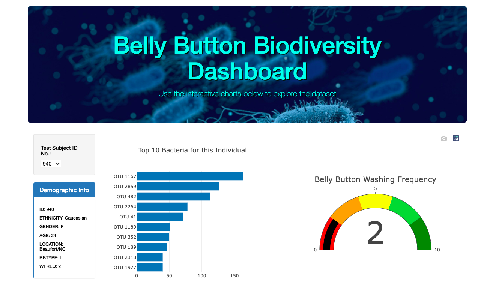
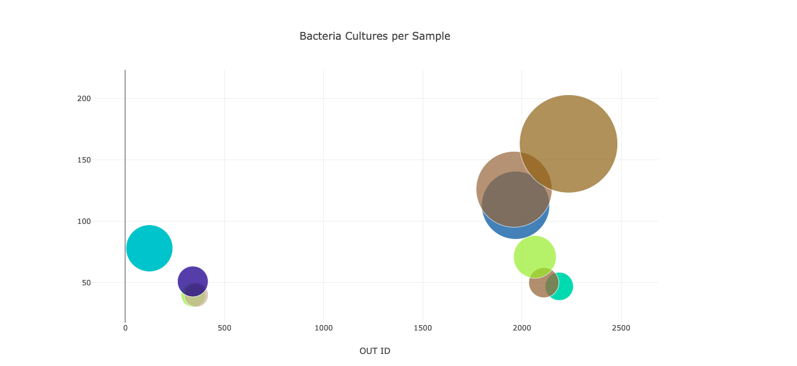

# BellyButton

The purpose of this repository is to visualize data for bacteria culture samples taken from the bellybuttons of participants. The primary resource used is the file samples.json, with all of the sample data. The languages involved in this study are primarily JavaScript and HTML, with style elements added using CSS.

This image shows the top of the created webpage with:

* The jumbotron image (taken from pixabay.com, no attribution required and free for commercial use) and title
* A drop-down list that allows the user to select the participant by ID number
* A panel with demographic information for the selected participant
* A guage chart with the bellybutton washing frequency of the selected participant
* A horizontal bar chart displaying the top 10 OTUs present in the participant's sample

This image shows the bottom of the created webpage with a bubble chart displaying the bacteria cultures per sample in greater detail.
